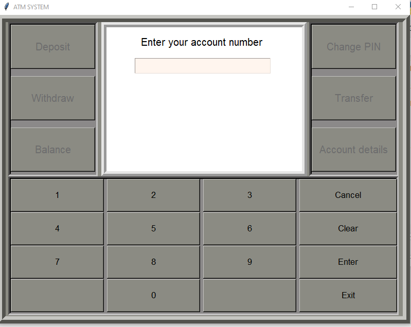
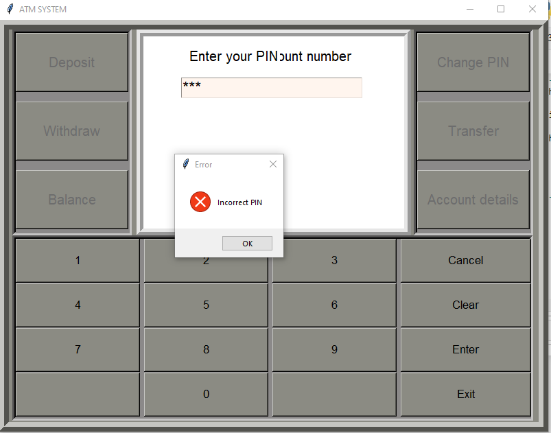
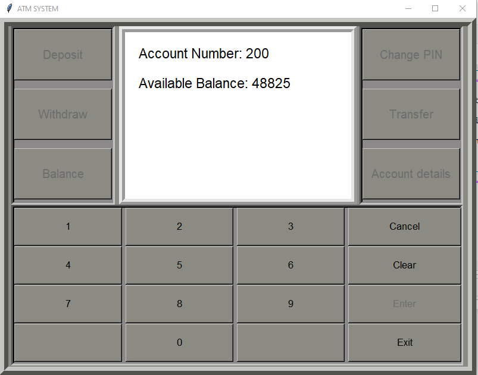

# ATM System with Face recognition and liveness detection
This repository showcases an ATM System developed in Python using the tkinter module, for database excel sheet is used and openpyxl module is used to perfrom CRUD operations on it. The face_recognition libarary is used to compare faces [ in sem 4 i didnt knew to make NN models ;/ ]. The user has to blink 3 times to ensure a liveness, also if phone is detected the system shuts down.

https://github.com/user-attachments/assets/4eb07a2d-6d61-40a6-b88d-b7af22763537

## Images

## Dependencies
- face_recognition
- opencv
- os
- datetime
- tkinter
- openpyxl
- DNN models (can be found in repo)

